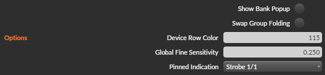

# Twister Sister <!-- omit in toc -->

A Bitwig Studio controller extension for the
[DJ TechTools MIDI Fighter Twister](https://www.midifighter.com/#Twister).

## Table of Contents <!-- omit in toc -->

- [Installation](#installation)
- [Hardware](#hardware)
  - [Track & Device Bank (Bank 1)](#track--device-bank-bank-1)
    - [Notes](#notes)
  - [User Mappable Bank (Bank 2-4)](#user-mappable-bank-bank-2-4)
- [Options](#options)
  - [Show Bank Popup](#show-bank-popup)
  - [Device Row Color](#device-row-color)
  - [Global Fine Sensitivity](#global-fine-sensitivity)
  - [Pinned Indication](#pinned-indication)
- [Project Settings](#project-settings)
  - [User Mappable Knob Colors](#user-mappable-knob-colors)
- [Specific Device Settings](#specific-device-settings)
  - [Devices](#devices)
  - [Controls](#controls)
  - [Finding IDs](#finding-ids)

## Installation

1. Extract the zip file.

2. Load the Twister Sister settings into your MIDI Fighter Twister.

    1. Open the MIDI Fighter Utility and ensure your device is connected.
    2. Click `File -> Import Settings...` and select the file `TwisterSister.mfs`.
    3. Click `SEND TO MIDI FIGHTER`.

3. Copy `TwisterSister.bwextension` and `SpecificDeviceSettings.toml` to the following location:

    - Windows: `%USERPROFILE%/Documents/Bitwig Studio/Extensions`
    - Mac:     `~/Documents/Bitwig Studio/Extensions`
    - Linux:   `~/Bitwig Studio/Extensions`

4. Add your controller in Bitwig Studio.

    1. Open Bitwig Studio and navigate to `Settings -> Controller` in the dashboard.

    2. If auto-detection works then the device will automatically be added and you can skip the
       remaining steps.

    3. If auto-detection has failed then click on `+ Add Controller` then select `DJ TechTools` from
       the hardware vendor drop down, `Twister Sister` in the product list and click `Add`.  
       

    4. If your controller is not automatically added to the MIDI in and out ports then select them
       manually. Once both ports have a device assigned the extension will activate.  
       

## Hardware

### Track & Device Bank (Bank 1)

| Knob | Twist                       | Click                     | Double Click    | Long Press                | Shift Click               | Shift Long Press | RGB Light                              |
| ---- | --------------------------- | ------------------------- | --------------- | ------------------------- | ------------------------- | ---------------- | -------------------------------------- |
| 1    | Select track                | Navigate groups (fold)    | -               | Toggle pinned             | Navigate groups (no fold) | Toggle arm       | Follow track color & pinned indication |
| 2    | Track volume                | Toggle sensitivity        | Reset volume    | Toggle mute               |                           | -                | Follow track color                     |
| 3    | Track pan                   | Toggle sensitivity        | Reset pan       | Toggle solo               |                           | -                | Follow track color                     |
| 4    | Current send volume         | Cycle through track sends | -               | -                         |                           | -                | Follow send color                      |
| 5    | Select device               | Toggle enable             | -               | Toggle pinned             | Toggle expand             | -                | Device row color & pinned indication   |
| 6    | Select remote controls page | Show/hide device UI       | -               | Show/Hide remote controls |                           | -                | Device row color                       |
| 7    | Specific device parameter 1 | Toggle sensitivity        | Reset parameter | Insert device before      |                           | -                | Device row color                       |
| 8    | Specific device parameter 2 | Toggle sensitivity        | Reset parameter | Insert device after       |                           | -                | Device row color                       |
| 9-16 | Remote control parameter    | Toggle sensitivity        | Reset parameter | -                         |                           | -                | Remote control color                   |

| Side Button  | Action    |
| ------------ | --------- |
| Left Side 1  | -         |
| Left Side 2  | -         |
| Left Side 3  | -         |
| Right Side 1 | -         |
| Right Side 2 | Next bank |
| Right Side 3 | Shift     |

### 4 (or 8) tracks Mixer (Bank 2)

**NOTE**: the 8-track mode will require _2 MF-Twister modules_

Use `dual twister mode` to have 8 track pages, if you have 2 MFTs. 
(in this mode, bank buttons are moved to the left, for your convenience so you can have your
MFTs side-to-side :smile:)

Use `Extender` in settings to set specific MFT as a '2nd page'. When set in this mode, MFT will
control tracks which numbers are in parens.
(When in extender mode, bank buttons stays to the right, so you can have them side-by-side)

| Knob | Twist                    | Click                     | Hold & Twist     | Long Press       | RGB Light                         |
| ---- | ------------------------ | ------------------------- | ---------------- | ---------------- | --------------------------------- |
| 1-4  | Send 1 track 1-4 (5-8)   | -                         |  -               | -                | Follow track color                |
| 5-8  | Send 2 track 1-4 (5-8)   | Arm                       |  -               | -                | Follow track color & arm status   |
| 9-12 | Send 3 track 1-4 (5-8)   | Solo                      |  -               | -                | Follow track color & solo status  |
| 13-16| Track volume 1-4 (5-8)   | Mute                      |  Pan             | -                | Follow track color & mute status  |
| 3    | ...                      | Previous 8-track page     |  -               | Navigate group   | -                                 |
| 4    | ...                      | Next 8-track page         |  -               | Navigate group   | -                                 |

No further pages are planned here, if you get n-pages to work, please open an issue. :smile:

## Eq Mode

If you check `Enable EQ 3rd band`, the 3rd bank become the closest EQ+ controller.

| Knob | Twist                 | Hold & Twist     | Double-click     | RGB Light               |
| ---- | --------------------- | ---------------- | ---------------- | ----------------------- |
| 1-4  | Band 1-4 frequency    |  Band 1-4 Q      | Mute band        | Freq color & mute:off   |
| 5-8  | Band 1-4 gain         |  Band 1-4 Type   | Turn band off    | Freq color & OFF:Off    |
| 9-12 | Band 5-8 frequency    |  Band 5-8 Q      | Mute band        | Freq color & mute:off   |
| 13-16| Band 1-4 gain         |  Band 5-8 Type   | Turn band off    | Freq color & OFF:Off    |

## dual twister mode

- enable dual mode for 8-track pages
- set a second twister in dual mode + extender to get 4-8 tracks' control
- in extender mode, bank buttons are on the right

When switching mode, you need to restart the extensions in order to process the config change

## two single mode twister

This will behave poorly as both twisters will bind to the first 4-tracks

#### Notes

- The color palette on the Twister is very limited. Colors are matched as closely as possible.

- If a device or parameter does not exist in the current context then the corresponding lights will
  be off.

- See the section on [specific device settings](#Specific-Device-Settings) for information on
  configuring knobs 7 and 8.

- To activate the shift actions hold the "shift" side button.

- See the section on [pinned indication](#pinned-indication) for information on how track and device
  pinned state is indicated by the RGB LEDs.

### User Mappable Bank (Bank (3)-4-5)

| Knob | Twist               | Hold & Twist    | Double Click      | RGB Light       |
| ---- | ------------------- | --------------- | ----------------- | --------------- |
| 1-16 | Mapped parameter(s) | Set light color | Reset light color | User selectable |

| Side Button  | Action        |
| ------------ | ------------- |
| Left Side 1  | -             |
| Left Side 2  | -             |
| Left Side 3  | -             |
| Right Side 1 | Previous bank |
| Right Side 2 | Next bank     |
| Right Side 3 | Go to bank 1  |

## Options

These are global options that apply to the specific device across all projects. They are accessed in
the controller settings in the Bitwig Studio dashboard.

### Show Bank Popup

Enable/disable showing a popup notification when banks are changed.

### Device Row Color

Sets the color used for knobs 5-8 in the [track & device bank](#Track-&-Device-Bank-(Bank-1)). This
uses the same color values as the [user mappable knobs](#User-Mappable-Knob-Colors).

### Global Fine Sensitivity

Sets the fine sensitivity factor for all encoder controls. The lower the number, the finer the
movement.

### Pinned Indication

Sets the light animation that will be used to indicate when a track or device is pinned. These
animations are described in the twister user manual.

When a track or device is pinned, the MIDI Fighter Twister will not follow the current track or device selected with the mouse or another controller. Info about the state of a pinned track or device is available in the Studio I/O panel in Bitwig Studio.

## Project Settings

These are per project settings and will be saved with each project. They are accessed in the I/O
panel of Bitwig Studio.

### User Mappable Knob Colors

Show or hide the settings for each bank using the bank selector. Each knob can have it's color set
to one of the 125¹ colors supported by the Twister. A value of 0 will turn the light off.

These settings can also be changed by holding and twisting any of the user mappable knobs.

_¹ This should be 126 colors but there is a
[bug](https://github.com/DJ-TechTools/Midi_Fighter_Twister_Open_Source/issues/9) in the latest
software._

## Specific Device Settings

The specific device feature allows you to assign two device specific parameters to knobs 7 and 8 in
the [track & device bank](#Track-&-Device-Bank-(Bank-1)). These follow the selected device.

The settings file `SpecificDeviceSettings.toml` allows you to configure which parameters for which
devices will be assigned. The file is in [TOML](https://toml.io) format.

### Devices

Devices are added to the settings file into one of three table arrays.

- `bitwig` for Bitwig Studio devices
- `vst3` for VST3 devices
- `vst2` for VST2 devices

Each table in the array consists of an `id` key and a `params` table that contains any number of
parameter ID keys. The type of the ID and parameters is different for each of the three types.

| Device Type | ID Type     | Parameter Type |
| ----------- | ----------- | -------------- |
| Bitwig      | UUID String | String         |
| VST3        | String      | Integer        |
| VST2        | Integer     | Integer        |

See the included `SpecificDeviceSettings.toml` file for examples.

### Controls

The `controls` table contains two string arrays, `knob1` and `knob2`. The strings in these arrays
are the device parameter key names that will be assigned to the respective knob in the
[track & device bank](#Track-&-Device-Bank-(Bank-1)).

For example, inserting the string `"mix"` into the array will assign any parameters defined with a
key `mix` to that knob.

See the included `SpecificDeviceSettings.toml` file for examples.

### Finding IDs

In order to retreive IDs for devices and their parameters you must add a configuration option to
Bitwig Studio.

1. Create a file with the name `config.json` in your user settings directory. The location of this
   directory is platform dependent:

    - Windows: `%LOCALAPPDATA%/Bitwig Studio`
    - Mac:     `Library/Application Support/Bitwig/Bitwig Studio`
    - Linux:   `~/.BitwigStudio`

2. Add the following line to the `config.json` file: `can-copy-device-and-param-ids: true`

3. Restart Bitwig Studio

Once you have this setting in place, you can retreive IDs from the context menu of the device and
parameters.

